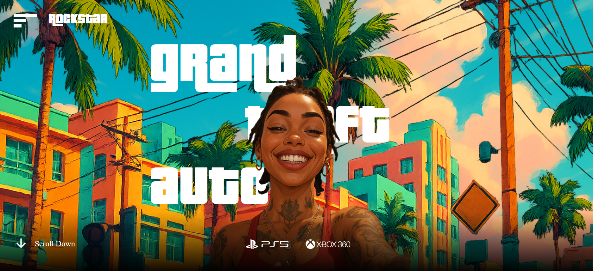

# 🌆 GTA VI Fan Website

Welcome to the **GTA VI Fan Website**, a sleek, responsive, and visually rich fan project inspired by the upcoming Grand Theft Auto VI game. The site highlights the trailer, characters, and the vibe of the iconic Vice City — all built with love for the franchise.

Explore the world of GTA VI through cinematic visuals, interactive sections, and an immersive design experience.

🔗 [Live Website](https://gta-rs.netlify.app/)

---

## 📸 Preview

---

## ✨ Features

- 🎬 Embedded GTA VI Official Trailer  
- 👥 Character Showcase  
- 🌇 Vice City-Inspired Visuals  
- 📱 Fully Responsive Design  
- 🎨 Smooth Scroll Animations and Clean UI  

---

## 📌 About This Site

This is a fan-made website for **GTA VI**, designed to showcase the trailer, characters, and visuals in a clean, interactive layout — offering fans an immersive glimpse of what’s coming.

---

## 📞 Contact

- 📧 Email: [rudrakshisharma86@gmail.com](mailto:rudrakshisharma86@gmail.com)  
- 💼 LinkedIn: [Rudrakshi Sharma](https://www.linkedin.com/in/rudrakshi-sharma/)  
- 🐙 GitHub: [itsrudra143](https://github.com/itsrudra143)

---

## 📄 Disclaimer

This is a non-commercial fan project and is not affiliated with Rockstar Games or Take-Two Interactive.
